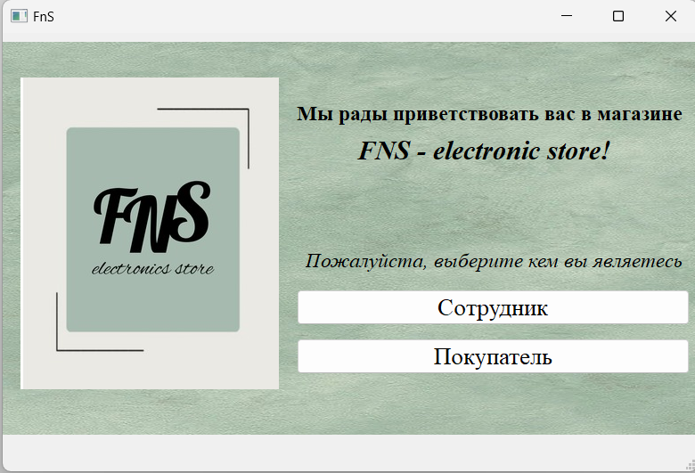

# Видео с демонстрацией творческой работы: https://youtu.be/h6d5cjf27aA
# ARM and Travelling Salesman Problem
# Отчёт по теме "Творческая работа за 2 семестр"
# Автоматизированное рабочее место
## Постановка задачи
Реализовать автоматизированное рабочее место консультанта в магазине электроники. Автоматизированное рабочее место (АРМ) - это комплекс оборудования (технических средств) и программного обеспечения, решающий совокупность задач, определяемых функциональным назначением рабочего места. Основными характеристиками АРМ являются:

* Возможности автоматизации процессов обработки данных и информации;
* Интеграция различных технических средств (компьютера, принтера, сканера и другого оборудования);
* Наличие программных средств, автоматизирующих специфические задачи;
* Использование средств связи для обмена данными и информацией с другими рабочими местами.
## Анализ задачи
* Для обработки событий использован фреймворк Qt. Qt - это популярная кроссплатформенная C++ библиотека для разработки интерфейса. Она позволяет создавать приложения с графическим интерфейсом, которые будут работать в широком диапазоне операционных систем. Основные возможности Qt:

    * Кроссплатформенность. Приложения, созданные с использованием Qt, могут работать в Windows, macOS, Linux и других ОС.
    * Преодоление ограничений ОС. Qt предоставляет единые API для выполнения таких задач, как ввод/вывод, файловая система, сеть и т.д.
    * Встроенные виджеты. Qt имеет богатый набор виджетов, таких как кнопки, окна, списки, таблицы и другие.
    * Классовая модель. Все в Qt организовано в виде классов с наследованием.
    * Инструментарий разработки. Qt Creator - IDE для создания приложений с Qt.
    * Открытый исходный код. Qt доступен на условиях LGPL.
    * Поддержка многих языков. Qt официально поддерживает C++, Python, JavaScript, QML и другие.
    * Расширяемость. Возможность расширения Qt библиотек и создания собственных виджетов.
* В качестве базы данных использована SQLite - легковесная база данных, работающая по принципу "собственный формат данных = один файл". Основные особенности SQLite:

    * Независимость от сервера. SQLite не требует отдельного сервера базы данных. Она содержит весь необходимый функционал в одном файле.
    * Кроссплатформенность. SQLite поддерживает Windows, Linux, macOS, Android и другие платформы.
    * Простота использования. SQLite имеет простой SQL интерфейс и не требует сложной настройки.
    * Небольшой размер. Файл базы данных SQLite обычно менее 10 МБ.
    * Высокая скорость. Запросы обрабатываются быстро благодаря простоте структуры.
    * Свободная и открытая. SQLite распространяется по лицензии Public Domain. Исходный код полностью доступен.
    * Поддержка транзакций. Обеспечивается атомарность операций и целостность данных.
    * Встроенная во многие системы. Android, iOS, Python, PHP, Java и другие системы используют SQLite.
* Для обработки информации и её хранения, полученной из баз данных использовались следующие классы Qt: 

    * __QSqlDatabase__ - это класс QT, который представляет подключение к реляционной базе данных. Он позволяет устанавливать соединение, выполнять SQL-запросы и получать доступ к таблицам.
    * __QSqlQuery__ - это класс QT, который предназначен для выполнения SQL-запросов к реляционным базам данных.
    * __QSqlTableModel__ - это класс QT, предоставляющий модель данных для отображения содержимого таблицы базы данных. Он наследуется от QAbstractTableModel и предназначен для использования в QTableView и QTreeView.
    * __QSqlError__ - это класс QT, предназначенный для хранения информации об ошибках, связанных с работой с базами данных. Он используется в QSqlQuery, QSqlDatabase и других классах для формирования и передачи ошибок.
    * __QSqlRecord__ - это класс QT, представляющий запись реляционной базы данных. Он используется для работы с данными, извлеченными из базы данных.
## UML - диаграмма

## Скриншоты работы программы

Рис. 1 - Окно входа в систему.

Рис. 2 - Авторизация сотрудника магазина.

Рис. 3 - Доступные сотруднику функции.

Рис. 4 - База данных покупателей.

Рис. 5 - База данных заказов.

Рис. 6 - База данных товаров.

Рис. 7 - Анкета покупателя.

Рис. 8 - Каталог товаров.

Рис.9 - Окно со статусом товара для покупателя.

